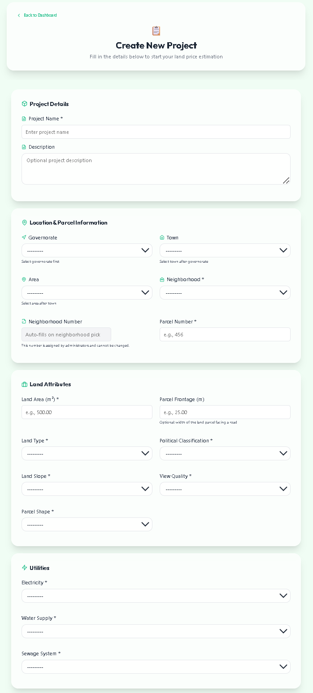
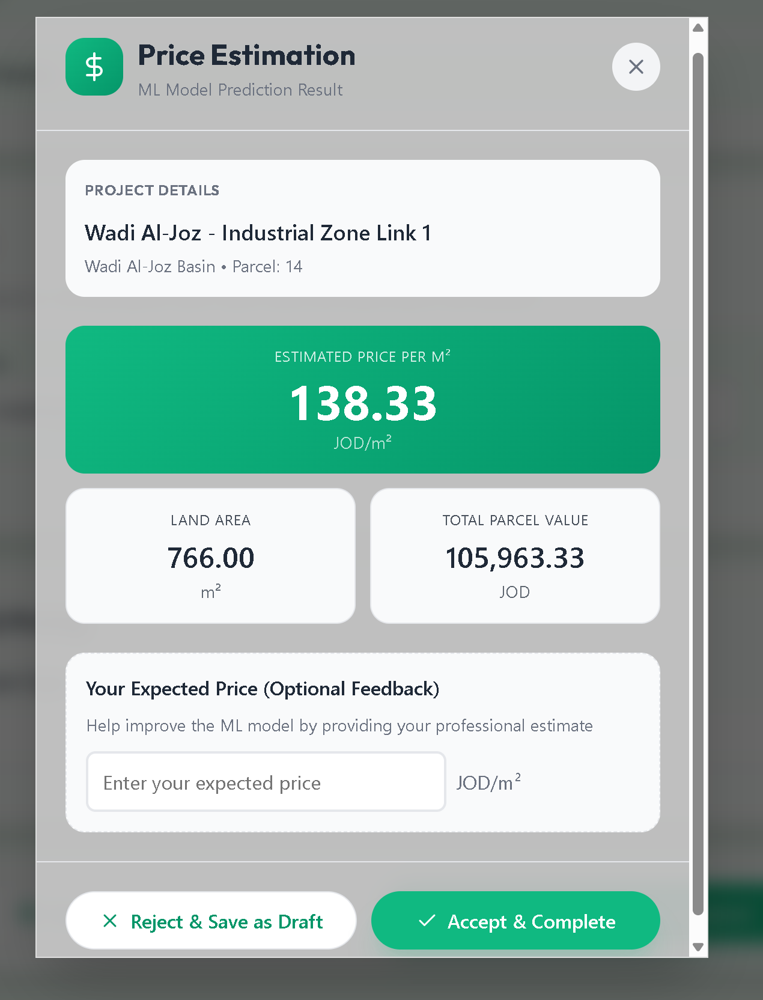
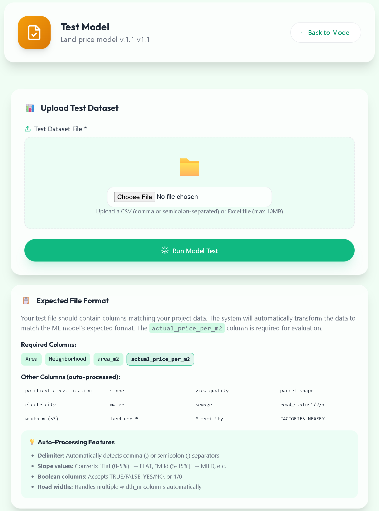
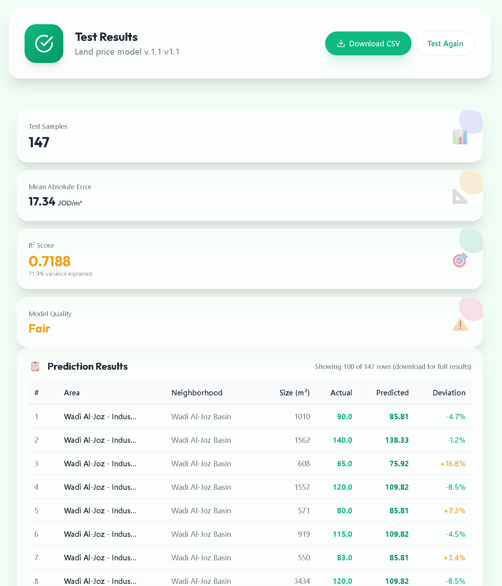
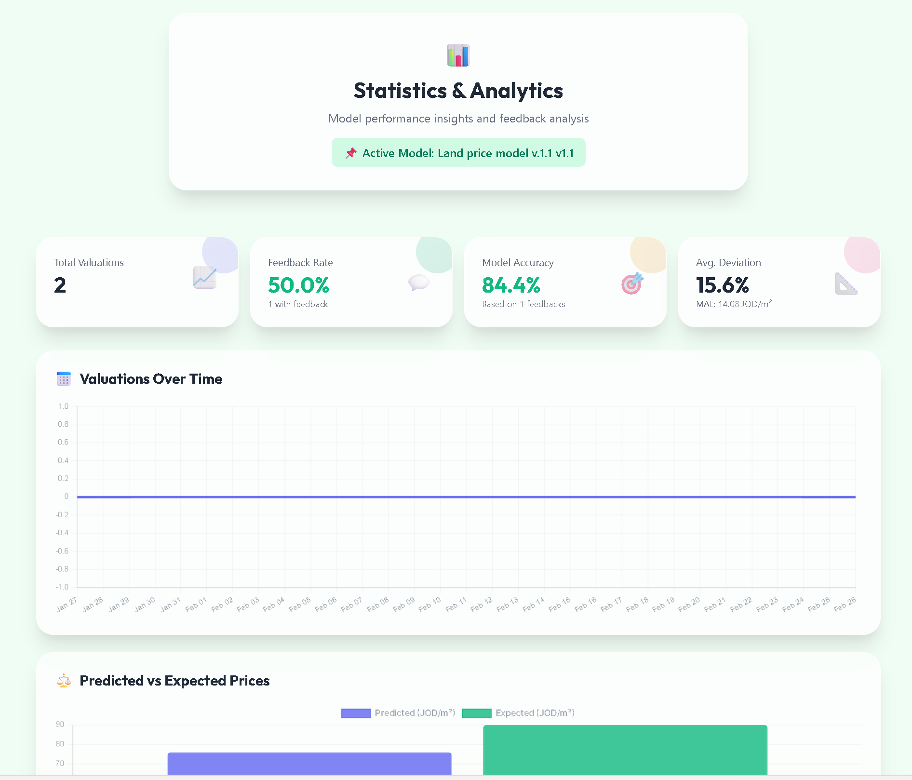

# Land Price Estimator

Machine learning–powered land valuation system that assists land appraisers in estimating parcel prices using real-world data.

## Problem

Estimating land prices manually is time-consuming and subjective.  
Land appraisers must evaluate many factors including location, infrastructure, zoning, and terrain.

This process can lead to inconsistencies and inefficiencies.

## Solution

This system uses a Regression Tree machine learning model trained on real-world parcel data to provide objective and data-driven land price estimates.

The platform enables appraisers to submit parcel details and receive instant price predictions with accuracy insights and deviation analysis.

## System Roles

### 🧑‍💼 Appraiser
- Submit land parcel data for valuation
- View prediction results and deviation
- Manage and search previous projects

### 🧪 Data Scientist
- Upload and test ML models
- Activate model versions
- Monitor performance metrics

### ⚙️ Admin
- Manage system configuration and users

- ## Interface Preview

### Landing & Login

### Appraiser Dashboard

### New Valuation Form

### Prediction Results

### Data Scientist Dashboard

### Model Testing Interface

### Model Testing Results

### Model Performance Statistics

## Machine Learning Pipeline

1. Data collection from real-world land parcel records
2. Data cleaning and preprocessing
3. Feature engineering and encoding
4. Feature selection
5. Model training using Regression Tree algorithm
6. Hyperparameter tuning using Grid Search
7. Model evaluation using cross-validation metrics
8. Model deployment for real-time predictions

## Model Performance

- R² Score: 0.7188
- Mean Absolute Error: 17.34 JOD/m²
- Average deviation: ~15%
- Cross-validation used for reliability

The model explains approximately 72% of price variance.

## Technologies Used

- Python
- Django
- Scikit-learn
- Pandas & NumPy
- HTML/CSS/JavaScript
- SQLite

## Installation & Setup

### 1. Clone repository
git clone https://github.com/m-q000/Land-Price-Estimator.git

### 2. Navigate into project
cd Land-Price-Estimator

### 3. Create virtual environment
python -m venv env
source env/bin/activate   # Mac/Linux
env\Scripts\activate      # Windows

### 4. Install dependencies
pip install -r requirements.txt

### 5. Run migrations
python manage.py migrate

### 6. Start server
python manage.py runserver

## Future Improvements

- Deploy system to cloud environment
- Improve model accuracy with larger datasets
- Introduce automated model retraining

## Authors

**Mohammad Samer AlQadi**  
**Mohammad Fareed Amleh**

Aspiring data professionals focused on machine learning, analytics, and building intelligent systems that support better decision-making.
